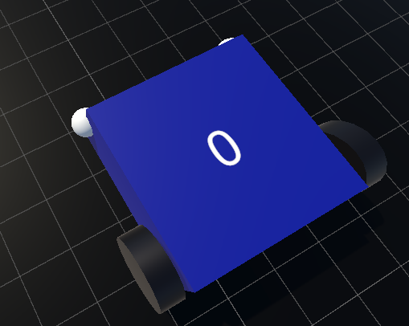
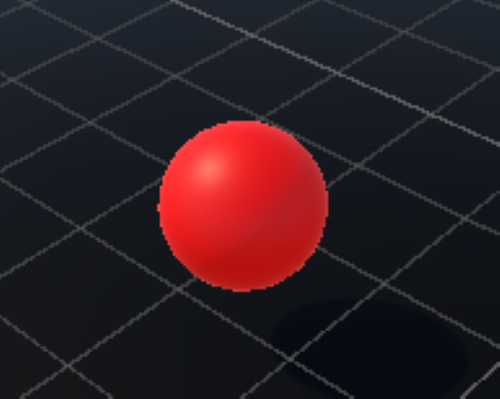
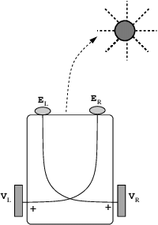
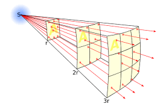
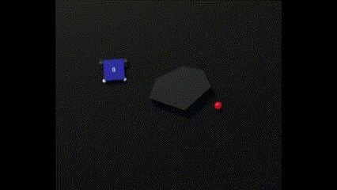
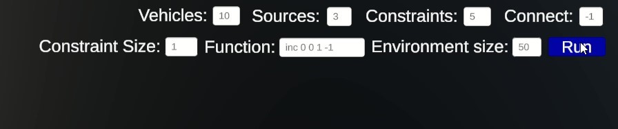

# Braitenberg-Vehicle-Simulator
A simulated environment for analyzing the behaviors of the Braitenberg Vehicles, using Unity.

https://github.com/pliam1105/Braitenberg-Vehicle-Simulator/assets/34167782/f8d6cd16-ec84-404f-9eb5-6490ee4878bc

## Overview
The environment consists of:
* Some *vehicles*, which have two sensor positions, with a set of sensors in each one, and two motors, whose speed is determined by the sensor output.
<table align="center"><tr><td align="center"></td></tr><table> 

* Some *sources*, which radiate some type e.g. heat, temperature, which is represented from a number in $[0, number\ of\ types-1]$
<table align="center"><tr><td align="center"></td></tr><table> 

* Some *constraints*, which are some time-dependent areas where the vehicles cannot enter (they are represented by blocks with walls where the vehicles bounce on)
<table align="center"><tr><td align="center"></td></tr><table> 

<table><tr><td></td><td>The basic characteristic of Braitenberg Vehicles is that the speed of each motor is determined either from the input of the corresponding sensor (on the same side), or the opposite one, and this change of connections, as well as the function with which the sensor input is connected to the motor speed, can determine the vehicle's behavior.</td></tr><table>

<table><tr><td>The input of the sensors behaves like having a source of light or heat radiating to all directions, so it is governed by the inverse square law. When we have multiple sources, the total radiation is the sum of the radiation the sensor receives from each source.</td><td></td></tr><table>

The constraints are blocks that move randomly within a radius from their start position. The vehicles bounce off these blocks, since a force is exerted on them upon impact, and there is a damping force that limits this bounce to not be very big.
<table align="center"><tr><td align="center"></td></tr><table> 
Also, since this environment consists of multiple vehicles, in order for them to not collide with each other (although they still do, but less), I added a repelling force for each pair of vehicles, that is stronger when the vehicles are closer.

## Input
There are some input boxes, where you can insert the number of vehicles, constraints and sources, the type of connection of the sensors ($1$ for same sensor/motor, $-1$ for opposite), the size of the constraints ($1$ is the default and the other sizes are multiplied by that), the dimensions of the environment, in which the objects are spawned (a good configuration is $1-1.5$ for each vehicle/constraint), and the function between the sensors and the motors.
<table><tr><td></td></tr></table>

The function input is given a string of 5 parameters: the type of the function, which can be: *inc* -> increasing function, *dec* -> decreasing, *inc_dec* -> increasing then decreasing, *dec_inc* -> decreasing then increasing. Also, $x_{0}$ and $y_{0}$, the turning point of the function ($x_{0}$ and $y_{0}$ are in the range $[0,1]$ and the output is then scaled based on that), and $slope\ up$ and $slope\ down$ which are the slopes of the function in the increasing and decreasing points respectively. The string overall is: $$function \textunderscore type\  x_{0}\  y_{0}\  slope \textunderscore up \  slope \textunderscore down$$

## Run
To run the program, just unzip the zip folder (you can find it in [releases](https://github.com/pliam1105/Braitenberg-Vehicle-Simulator/releases/latest)), find `Braitenberg Vehicle Simulator.exe` and run it.\
Pressing the run button it generates a random configuration with the required parameters (you can do that as many times as you want, it will reset the environment and create a new one).